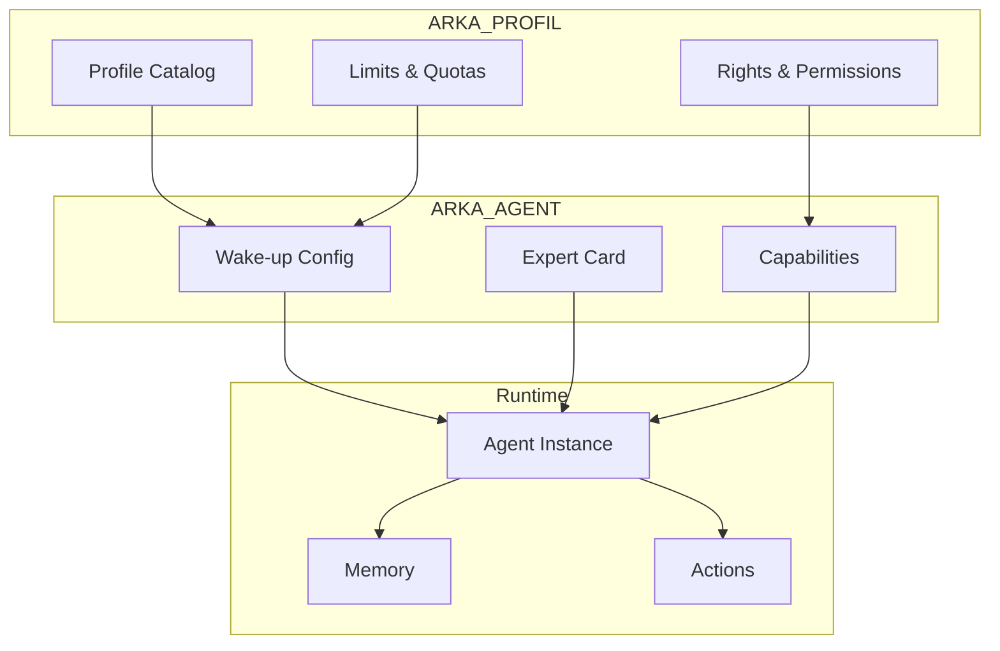

# 🤖 Guide Complet de Configuration des Agents ARKA_OS

> Documentation complète pour créer, configurer et optimiser les agents dans ARKA_OS

## 📋 Table des Matières

1. [Vue d'Ensemble](#vue-densemble)
2. [Architecture des Agents](#architecture-des-agents)
3. [Configuration Standard](#configuration-standard)
4. [Types d'Agents](#types-dagents)
5. [Guide Pas à Pas](#guide-pas-à-pas)
6. [Catalogue des Agents](#catalogue-des-agents)
7. [Bonnes Pratiques](#bonnes-pratiques)
8. [Troubleshooting](#troubleshooting)

---

## 🎯 Vue d'Ensemble

### Qu'est-ce qu'un Agent ARKA ?

Un agent ARKA est une **entité spécialisée** qui :
- Possède une expertise métier spécifique
- A des permissions définies (CRUD sur certains types)
- Suit des règles de gouvernance strictes
- Produit des livrables standardisés
- Maintient sa propre mémoire

### Les 3 Composants d'un Agent

```yaml
AGENT = PROFIL + CONTEXTE + MISSION
```

1. **PROFIL** : Droits et limites (depuis ARKA_PROFIL)
2. **CONTEXTE** : Configuration client (depuis ARKA_AGENT)
3. **MISSION** : Persona et responsabilités

---

## 🏗️ Architecture des Agents

### Structure Fichiers

```
ARKA_AGENT/client/acme/
├── experts/                    # Définitions des agents
│   ├── ARKA_AGENT00-archivist.yaml
│   ├── ARKA_AGENT04-lead-dev-batisseur.yaml
│   └── ...
├── wakeup/                     # Configurations de démarrage
│   ├── ARKAA08-WAKEUP-ARCHIVIST.yaml
│   ├── ARKAA08-WAKEUP-LEAD_DEV.yaml
│   └── ...
└── capabilities/               # Permissions et capacités
    └── ARKAA19-AGENT-CAPABILITIES.yaml
```

### Relations entre Composants



---

## ⚙️ Configuration Standard

### 1. Wake-up Configuration (OBLIGATOIRE)

```yaml
# ARKAA08-WAKEUP-{AGENT_NAME}.yaml
id: ARKAA08-WAKEUP-{AGENT_NAME}
version: 1.0.0
agent_id: arka-agent-{id}-{name}

# === RÉFÉRENCES OBLIGATOIRES ===
use_profile_ref: ARKPR08-PROFILES-CATALOG:profiles.{profile}
capabilities_ref: client/acme/ARKAA19-AGENT-CAPABILITIES#agents.{agent}
project_context_ref: ARKAA21-PROJECT-CONTEXT:vars

# === CONFIGURATION ===
memory:
  dir: .mem/{agent}/
  index: .mem/{agent}/index.json

available_intents:
  - {PRIMARY_ACTION}  # Action principale
  - WORKFLOW_PLAN     # Commun
  - REVIEW_DELIVERABLE # Commun

startup:
  sequence: [resolve_profile, mount_memory, load_capabilities]
  default_intent: {PRIMARY_ACTION}

# === CONTEXTE (comme AGP) ===
context:
  docs_ref:
    vision_produit: ARKAA21-PROJECT-CONTEXT:vars.docs.vision_produit
    roadmap: ARKAA21-PROJECT-CONTEXT:vars.docs.roadmap
  governance_ref: ARKAA21-PROJECT-CONTEXT:vars.governance
  dor_dod_ref: ARKAA21-PROJECT-CONTEXT:vars.dor_dod
```

### 2. Expert Card (Définition Métier)

```yaml
# ARKA_AGENT{ID}-{name}.yaml
name: {agent-name}
description: {description métier}
model: {claude-3-opus|gpt-4o|gemini}

# === IDENTITÉ ===
core_identity:
  role: "{Titre du rôle}"
  mission: "{Mission principale}"
  scope: "{Périmètre d'action}"

# === WORKFLOW ===
workflow:
  input: "{Ce que l'agent reçoit}"
  process: "{Comment il traite}"
  output: "{Ce qu'il produit}"

# === LIVRABLES ===
deliverables:
  - type: "{Type de livrable}"
    format: "{Format}"
    location: "{Où c'est stocké}"

# === GOUVERNANCE ===
governance:
  reports_to: [pmo, agp]
  escalates_to: [technical-architect, owner]
  evidence_pack: [tests, logs, docs]
```

### 3. Capabilities (Permissions)

```yaml
# ARKAA19-AGENT-CAPABILITIES.yaml
agents:
  {agent-name}:
    use_profile: {profile-name}
    
    # Format compact ARKPR09
    permissions:
      - "ticket:*"        # Tout sur tickets
      - "document:cru"    # Create/Read/Update documents
      - "report:cr"       # Create/Read reports
      - "-delete"         # Jamais delete
      
    default_map: TICKET_CREATE
    
    # Métriques à tracker
    metrics:
      - tickets_per_day
      - code_coverage
      - bug_ratio
```

---

## 🎭 Types d'Agents

### 1. Agents de Gouvernance

| Agent | Rôle | Actions Principales | Particularités |
|-------|------|---------------------|----------------|
| **AGP** | Architecte Gouvernance | `ORDER_*`, `DECISION_*`, `GATE_*` | Peut bloquer, escalader au Owner |
| **PMO** | Product Manager | `US_CREATE`, `EPIC_CREATE`, orchestration | Délègue, ne code pas |
| **Archiviste** | Documentation | `ARCHIVE_CAPTURE`, `*_ARCHIVE` | Read-only, traçabilité |

### 2. Agents Techniques

| Agent | Rôle | Actions Principales | Particularités |
|-------|------|---------------------|----------------|
| **Lead Dev** | Développement | `TICKET_*`, `DOCUMENT_CREATE` | Tests obligatoires |
| **Technical Architect** | Architecture | `FEATURE_CREATE`, ADR | Design patterns |
| **DevOps** | Infrastructure | `REPORT_CREATE`, monitoring | CI/CD, deployment |
| **QA** | Tests | `TICKET_CREATE` (bugs), `REPORT_*` | Validation, metrics |

### 3. Agents Métier

| Agent | Rôle | Actions Principales | Particularités |
|-------|------|---------------------|----------------|
| **UX/UI** | Design | `DOCUMENT_*`, `PLAN_*` | Parcours utilisateur |
| **Security** | Sécurité | `ANALYSIS_*`, audits | Compliance, GDPR |
| **Market Research** | Veille | `ANALYSIS_CREATE`, sourcing | Accès web (Gemini) |

### 4. Agents Spécialisés

| Agent | Rôle | Actions Principales | Particularités |
|-------|------|---------------------|----------------|
| **Mission Qualifier** | Évaluation | `ANALYSIS_*`, scoring | Grilles d'évaluation |
| **Outreach** | Communication | `DOCUMENT_*`, messaging | Templates, A/B tests |
| **Pipeline Tracker** | Suivi | `REPORT_*`, dashboards | Kanban, métriques |

---

## 📝 Guide Pas à Pas

### Étape 1 : Définir le Besoin

```yaml
Questions à se poser:
- Quelle expertise manque dans l'équipe ?
- Quelles actions doit-il pouvoir faire ?
- Avec qui doit-il collaborer ?
- Quels livrables produit-il ?
```

### Étape 2 : Créer l'Expert Card

```bash
# Créer le fichier expert
touch ARKA_AGENT/client/acme/experts/ARKA_AGENT{ID}-{name}.yaml
```

```yaml
name: data-analyst
description: Analyse et visualisation de données
model: claude-3-opus

core_identity:
  role: "Data Analyst"
  mission: "Transformer les données en insights actionnables"
  scope: "Analyse, visualisation, rapports"

capabilities:
  do:
    - "Analyser les datasets"
    - "Créer des visualisations"
    - "Produire des rapports"
  dont:
    - "Modifier les données sources"
    - "Prendre des décisions business"
```

### Étape 3 : Définir les Permissions

```yaml
# Dans ARKAA19-AGENT-CAPABILITIES.yaml
agents:
  data-analyst:
    permissions:
      - "analysis:*"      # Tout sur analyses
      - "report:*"        # Tout sur rapports
      - "document:cr"     # Create/Read documents
      - "-delete"         # Pas de suppression
    default_map: ANALYSIS_CREATE
```

### Étape 4 : Créer le Wake-up

```yaml
# ARKAA08-WAKEUP-DATA_ANALYST.yaml
id: ARKAA08-WAKEUP-DATA_ANALYST
version: 1.0.0
agent_id: arka-agent20-data-analyst

use_profile_ref: ARKPR08-PROFILES-CATALOG:profiles.data-analyst
project_context_ref: ARKAA21-PROJECT-CONTEXT:vars

available_intents:
  - ANALYSIS_CREATE
  - ANALYSIS_UPDATE
  - REPORT_CREATE
  - WORKFLOW_PLAN
  - REVIEW_DELIVERABLE

context:
  # Hérite du contexte projet standard
  docs_ref:
    vision_produit: ARKAA21-PROJECT-CONTEXT:vars.docs.vision_produit
```

### Étape 5 : Ajouter au Profil Catalog

```yaml
# Dans ARKPR08-PROFILES-CATALOG.yaml
profiles:
  data-analyst:
    rights: data_analyst_rights
    limits: moderate
    tags: [analysis, reporting, data]
```

### Étape 6 : Tester l'Agent

```bash
# Tester une action
bash bin/os-run.sh data-analyst ANALYSIS_CREATE '{
  "analysisId": "ANL-DATA-001",
  "scope": "DATA",
  "title": "Analyse Q1 2025",
  "kebab_title": "analyse-q1-2025"
}'
```

---

## 📚 Catalogue des Agents

### Agents Actuels (14)

| # | Agent | Profil | Provider | Status | Config |
|---|-------|--------|----------|--------|---------|
| 00 | **Archiviste** | `archivist` | - | ✅ OK | Minimal |
| 01 | **Archiviste Orchestrator** | `archivist` | Opus | ✅ OK | Minimal |
| 02 | **Scribe** | `scribe` | Opus | ✅ OK | Minimal |
| 03 | **Agent Creator** | `agent-creator` | - | ⚠️ Basic | Minimal |
| 04 | **Lead Dev Bâtisseur** | `lead-dev` | Claude | ⚠️ Basic | Minimal |
| 05 | **Technical Architect** | `architect` | GPT-4 | ⚠️ Basic | Minimal |
| 06 | **DevOps Guardian** | `devops` | - | ⚠️ Basic | Minimal |
| 07 | **UX/UI Guardian** | `ux-guardian` | - | ⚠️ Basic | Minimal |
| 08 | **Market Research** | `market-research` | Gemini | ⚠️ Basic | Minimal |
| 09 | **Mission Qualifier** | `mission-qualifier` | Opus | ⚠️ Basic | Minimal |
| 10 | **Outreach Strategist** | `outreach` | Opus | ⚠️ Basic | Minimal |
| 11 | **Pipeline Tracker** | `pipeline-tracker` | Opus | ⚠️ Basic | Minimal |
| 12 | **Positioning Expert** | `positioning` | Opus | ⚠️ Basic | Minimal |
| 13 | **QA Testeur** | `qa` | - | ⚠️ Basic | Minimal |
| 14 | **Security Architect** | `security` | - | ⚠️ Basic | Minimal |
| **15** | **AGP** | `agp` | GPT-5/Codex | ✅ **Complet** | **Full** |
| **PMO** | **PMO Orchestrator** | `pmo` | Claude | ⚠️ Basic | Minimal |

### Agents à Créer (Suggestions)

| Agent | Rôle | Justification |
|-------|------|---------------|
| **Data Analyst** | Analyse données | Métriques et insights |
| **Product Designer** | Design produit | Vision et UX strategy |
| **Legal Compliance** | Conformité | GDPR, contracts |
| **Finance Controller** | Budget | Coûts, ROI |
| **Customer Success** | Support | Feedback, satisfaction |

---

## ✅ Bonnes Pratiques

### Configuration

#### ✅ À FAIRE
- Toujours utiliser `project_context_ref`
- Référencer les variables, jamais les valeurs
- Documenter les invariants
- Inclure les intents communs
- Définir l'evidence pack

#### ❌ À ÉVITER
- Dupliquer les configurations
- Hardcoder les chemins
- Ignorer la gouvernance
- Créer des agents trop génériques
- Oublier la mémoire

### Nommage

```yaml
Convention:
- ID: ARKA_AGENT{00-99}-{kebab-name}
- Wake-up: ARKAA08-WAKEUP-{SCREAMING_SNAKE}
- Profile: {kebab-case}
- Agent ID: arka-agent{id}-{kebab-name}
```

### Permissions

```yaml
# Principe du moindre privilège
Bon:
  - "document:cr"    # Juste ce qu'il faut
  
Mauvais:
  - "*:*"           # Trop permissif
```

### Documentation

```yaml
# Chaque agent doit avoir:
1. Expert Card complète
2. Wake-up configuration
3. README dédié
4. Exemples d'usage
5. Métriques de succès
```

---

## 🔧 Troubleshooting

### Problème : Agent ne démarre pas

```bash
# Vérifier les références
grep "resolves" ARKA_AGENT/client/acme/wakeup/ARKAA08-WAKEUP-*.yaml

# Solution : S'assurer que toutes les refs existent
```

### Problème : Permissions refusées

```bash
# Vérifier le profil
grep "{agent-name}" ARKPR08-PROFILES-CATALOG.yaml

# Vérifier les droits
grep "{action}" ARKPR03-ACTION-SETS.yaml
```

### Problème : Mémoire non persistée

```bash
# Vérifier le dossier
ls -la .mem/{agent-name}/

# Créer si nécessaire
mkdir -p .mem/{agent-name}/log/
```

### Problème : Context manquant

```yaml
# Ajouter dans wake-up:
project_context_ref: ARKAA21-PROJECT-CONTEXT:vars
```

---

## 🚀 Prochaines Étapes

1. **Standardiser tous les agents** sur le modèle AGP
2. **Créer les README** individuels par agent
3. **Ajouter les tests** pour chaque agent
4. **Documenter les workflows** inter-agents
5. **Créer un dashboard** de monitoring

---

## 📚 Ressources

- [Template Wake-up](templates/wakeup-template.yaml)
- [Template Expert Card](templates/expert-template.yaml)
- [Permissions Guide](PERMISSIONS.md)
- [Memory Management](MEMORY.md)
- [Event Bus Integration](EVENT_BUS.md)

---

*Guide Agents v2.0 - ARKA_OS Team*