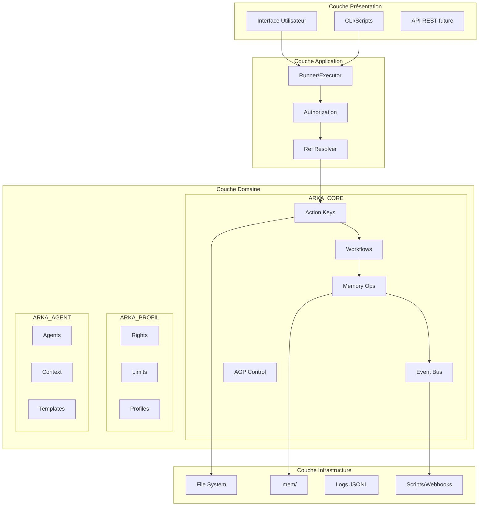
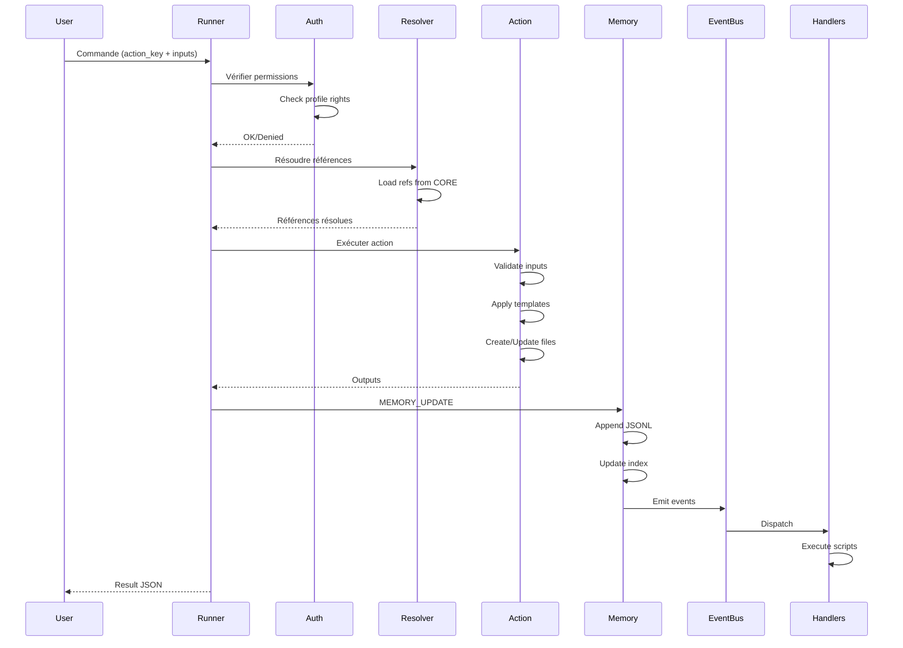

# 🏛️ Architecture ARKA_OS

> Guide technique détaillé de l'architecture du système d'orchestration multi-LLM

## Vue d'Ensemble



## 🎨 Principes de Design

### 1. **Séparation des Préoccupations**
- **CORE** : Règles immuables (constitution)
- **PROFIL** : Autorisations configurables
- **AGENT** : Contexte client spécifique

### 2. **Références vs Duplication**
- Jamais de copie de règles
- Tout est référencé : `BRIQUE:chemin.vers.valeur`
- Résolution lazy au runtime

### 3. **Event-Driven Architecture**
- Actions déclenchent des événements
- Event Bus distribue aux handlers
- Pas de couplage fort

### 4. **Immutabilité**
- CORE et PROFIL en lecture seule
- Seul AGENT est customizable
- Versioning SemVer strict

## 📦 Architecture Modulaire

### ARKA_CORE - Le Moteur

```yaml
ARKORE01-09: Constitution
├── Hiérarchie & Autorités
├── Règles Globales
├── Équipes & Limitations
├── Workflows & États
├── Spécifications d'Exécution
├── Matrices de Contrôle
├── Module Archiviste
├── Chemins & Gouvernance
└── Patterns de Nommage

ARKORE12-16: Opérations
├── Action Keys (API LLM)
├── Templates
├── Memory Operations
├── AGP Reactive Control
└── Event Bus
```

**Caractéristiques:**
- **16 briques** autonomes
- **Contrats stricts** entre briques
- **Invariants** garantis
- **Références croisées** validées

### ARKA_PROFIL - Les Permissions

```yaml
Structure:
├── Action Sets     # Groupes d'actions
├── Path Sets       # Chemins autorisés
├── Rights          # Bundles actions+paths
├── Limits          # Rate limits & quotas
├── Auth Policy     # Règles d'évaluation
├── Profiles        # Catalogue final
└── Permissions     # Format compact (nouveau)
```

**Flux d'Autorisation:**
1. Action demandée ∈ action_sets ?
2. Chemins output ⊆ allow_paths ?
3. Chemins output ∉ deny_paths ?
4. Rate limit respecté ?
5. → Exécution autorisée

### ARKA_AGENT - Le Contexte

```yaml
Configuration Client:
├── Context         # Secteur, locale, glossaire
├── Templates       # Override avec file://
├── Events Pack     # Subscriptions custom
├── Compliance      # Règles métier
├── Vocab Aliases   # Traductions domaine
├── Plan Directeur  # Vision & roadmap
└── Agents/         # 14+ agents configurés
```

## 🔄 Cycle de Vie d'une Action



## 💾 Système de Mémoire

### Structure Physique
```
.mem/
├── {agent}/
│   ├── log/
│   │   ├── 2025-01-29.jsonl
│   │   ├── 2025-01-30.jsonl
│   │   └── ...
│   └── index.json
```

### Format JSONL
```json
{"ts":"2025-01-29T10:00:00Z","actor":"lead-dev","action_key":"US_CREATE","scope":{...},"status":"success"}
{"ts":"2025-01-29T10:00:01Z","actor":"lead-dev","action_key":"MEMORY_UPDATE","scope":{...},"status":"success"}
```

### Operations
- **MEMORY_UPDATE** : Write automatique post-action
- **MISSION_INGEST** : Import de mission externe
- **READ_CONTEXT** : Lecture pour contexte LLM
- **PERIODIC_COMPACT** : Compression quotidienne

### Stratégies
- **Idempotence** : Coalesce sur 5 minutes
- **Rétention** : 180j défaut, 365j critical
- **Index** : Dernier état par scope
- **Isolation** : Par agent

## 🎭 Système d'Événements

### Topics Hiérarchiques
```yaml
Core Events:
├── Lifecycle
│   ├── *_CREATED
│   ├── *_UPDATED
│   ├── *_DELETED
│   └── *_ARCHIVED
├── Control
│   ├── DELIVERY_RECEIVED
│   ├── CONTROL_EVALUATED
│   └── OWNER_CONFIRMATION_REQUESTED
├── Memory
│   ├── MEMORY_UPDATED
│   └── MISSION_INGESTED
└── Workflow
    ├── STATE_CHANGED
    ├── GATE_PASSED
    └── GATE_REJECTED
```

### Dispatch Modes
1. **Local** : Scripts shell/JS
2. **Webhook** : HTTP POST
3. **Stdout** : Logs JSON
4. **Multi** : Combinaison

### Exemple Extension
```yaml
# ARKA_EXT/custom-hooks.yaml
override:
  ARKORE16-EVENT-BUS:
    subscriptions:
      - on: US_CREATED
        using: webhook
        run: "${JIRA_WEBHOOK}"
      - on: DELIVERY_RECEIVED
        using: local
        run: "notify-slack.sh"
```

## 🔐 Sécurité & Conformité

### Niveaux de Sécurité

| Niveau | Description | Mesures |
|--------|-------------|---------|
| **L1 - Core** | Constitution système | Read-only, versioned, signed |
| **L2 - Profil** | Permissions | Read-only, audit trail |
| **L3 - Agent** | Configuration | Customizable, validated |
| **L4 - Runtime** | Exécution | Sandboxed, rate-limited |
| **L5 - Data** | Mémoire/Fichiers | Encrypted at rest, RBAC |

### Conformité
- **GDPR** : Data isolation, retention policies
- **SOC2** : Audit trails, access control
- **ISO27001** : Risk management, incident response

### Menaces & Mitigations

| Menace | Impact | Mitigation |
|--------|--------|------------|
| Injection | High | Input validation, regex |
| Privilege Escalation | High | Strict RBAC, deny-first |
| Data Leak | Medium | Path isolation, secrets management |
| DoS | Medium | Rate limiting, quotas |
| Tampering | Low | Checksums, versioning |

## 🚀 Performance & Scalabilité

### Métriques Cibles

| Métrique | Cible | Actuel | Stratégie |
|----------|-------|---------|-----------|
| TTFT | <100ms | 150ms | Cache refs, lazy loading |
| Throughput | 100 req/s | 20 req/s | Async processing |
| Memory | <500MB | 320MB | ✅ OK |
| Startup | <2s | 3s | Precompile bundles |
| Actions/min | 60+ | 18 | Parallel execution |

### Bottlenecks Identifiés
1. **yq parsing** : Cache assemblies
2. **Ref resolution** : Memoization
3. **File I/O** : Batch operations
4. **Event dispatch** : Queue async

### Scalabilité Horizontale
```yaml
Future Architecture:
├── Load Balancer
├── Runner Pool (N instances)
├── Shared Memory (Redis)
├── Event Queue (RabbitMQ)
└── Object Storage (S3)
```

## 🔧 Points d'Extension

### 1. Nouveaux Action Types
```yaml
# Ajouter dans ARKORE12
NEW_TYPE_CREATE:
  inputs: [...]
  paths:
    dir_ref: "ARKORE08:..."
  naming:
    pattern_ref: "ARKORE09:..."
  post: ["MEMORY_UPDATE"]
```

### 2. Nouveaux Agents
```yaml
# ARKA_AGENT/client/*/experts/new-agent.yaml
name: new-specialist
permissions:
  - "document:*"
  - "analysis:cr"
```

### 3. Nouveaux Events
```yaml
# ARKORE16 extension
topics:
  custom:
    MY_CUSTOM_EVENT:
      payload: [...]
```

### 4. Nouveaux Workflows
```yaml
# ARKORE04 addition
workflows:
  my_workflow:
    states: [...]
    transitions: [...]
```

## 📊 Monitoring & Observabilité

### Métriques Clés
```yaml
Business Metrics:
- Actions par jour/agent
- Taux de succès/échec
- Temps moyen par action
- Utilisation mémoire

Technical Metrics:
- Latency percentiles (p50/p95/p99)
- Error rates
- Queue depth
- Cache hit ratio

System Metrics:
- CPU/Memory/Disk
- Network I/O
- Process health
```

### Logging Strategy
```yaml
Levels:
- ERROR: Failures critiques
- WARN: Anomalies non-bloquantes
- INFO: Actions business
- DEBUG: Détails techniques
- TRACE: Full execution path

Formats:
- Structured JSON
- Correlation IDs
- Timestamps UTC
```

### Health Checks
```yaml
Endpoints:
- /health/live    # Process alive
- /health/ready   # Dependencies OK
- /health/startup # Initialization done
```

## 🔄 Cycle de Release

### Versioning
- **CORE** : SemVer strict, breaking = major
- **PROFIL** : SemVer, new rights = minor
- **AGENT** : Client-specific, flexible

### Compatibility Matrix
| CORE | PROFIL | AGENT | Status |
|------|--------|-------|--------|
| 2.0.x | 1.3.x | *.* | ✅ Stable |
| 2.1.x | 1.4.x | *.* | 🧪 Beta |
| 3.0.x | 2.0.x | *.* | 🚧 Dev |

### Migration Strategy
1. **Backward Compatible** : Minor/Patch
2. **Deprecation Warning** : 1 version
3. **Breaking Change** : Major only
4. **Migration Guide** : Mandatory

## 🎯 Roadmap Technique

### Phase 1 - Consolidation (Q1 2025)
- [ ] Tests > 80% coverage
- [ ] Documentation complète
- [ ] Performance optimization
- [ ] Security audit

### Phase 2 - UI/UX (Q2 2025)
- [ ] Web dashboard
- [ ] Real-time monitoring
- [ ] Visual workflow builder
- [ ] Agent marketplace

### Phase 3 - Cloud Native (Q3 2025)
- [ ] Kubernetes deployment
- [ ] Multi-tenancy
- [ ] Distributed execution
- [ ] SaaS offering

### Phase 4 - AI Enhancement (Q4 2025)
- [ ] ML predictions
- [ ] Auto-optimization
- [ ] Anomaly detection
- [ ] Smart routing

---

## 📚 Références

- [Design Patterns](docs/PATTERNS.md)
- [Security Model](docs/SECURITY.md)
- [Performance Tuning](docs/PERFORMANCE.md)
- [Deployment Guide](docs/DEPLOYMENT.md)

---

*Architecture Document v2.0 - ARKA_OS Team*